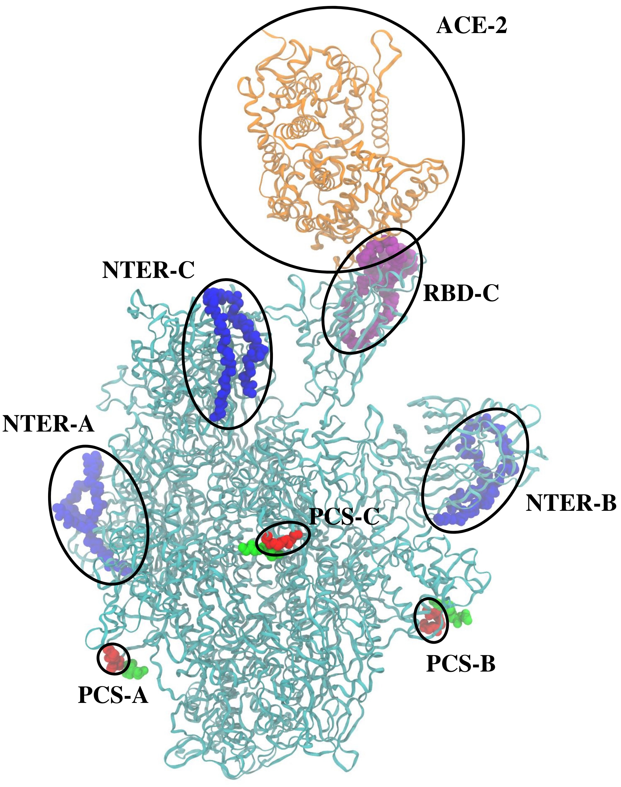

# Contrastive Machine Learning on COVID-19 Virus
**Amy X. Chen**'s research project on allosteric regulation of **SARS-CoV-2 spike protein** using **contrastive machine learning** 

A preprint is freely avaiable through <a href="https://doi.org/10.26434/chemrxiv-2023-clz1b" target="_blank" rel="noopener">ChemAxiv</a> or can be downloaded [here](machine_learning_manuscript.pdf).

**Abstract:** Allosteric regulation is common in protein-protein interactions and thus can be used in drug design. Nevertheless, the mechanism of allosteric regulation remains elusive for most proteins, including SARS-CoV-2 spike protein, despite extensive experimental endeavors over the past years. In the present computational study, the route of allosteric regulation of SARS-CoV-2 is examined by all-atom explicit solvent molecular dynamics simulations in conjunction with contrastive machine learning. It was found that peptide binding to the polybasic cleavage sites, especially the one at the first monomer of the trimeric SARS-CoV-2, activates the fluctuation of the spike protein’s backbone. This fluctuation eventually propagates to a nitrogen-terminal domain and its neighboring receptor-binding domain, remarkably weakening the latter’s binding affinity to the human cell receptor ACE2. Our study justifies the presence of allosteric regulation in SARS-CoV-2, paving the way for the systematic design of allosteric antibody inhibitors.  

 

<h4 align="center">Molecular structure of SARS-CoV-2 spike protein regulated by tetrapeptides (in green)</h4>                                
